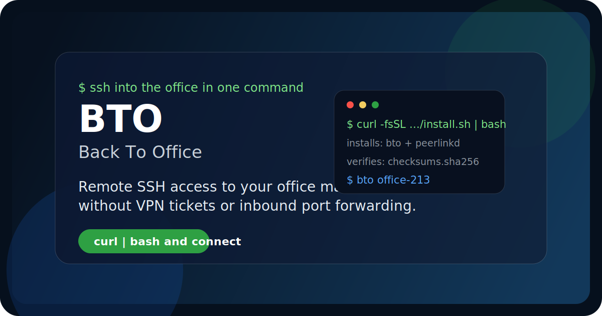

<p align="center">
  
</p>

<h1 align="center">BTO (Back To Office)</h1>

<p align="center">
  <strong>Remote SSH access to your office machine, without VPN tickets or inbound port forwarding.</strong>
</p>

<p align="center">
  <a href="https://github.com/hbliu007/back-to-office/releases/latest">
    
  </a>
  <a href="https://github.com/hbliu007/back-to-office/releases/latest">
    
  </a>
  
  
  
</p>

<p align="center">
  <a href="#install-in-30-seconds">Install</a> ·
  <a href="https://github.com/hbliu007/back-to-office/releases/latest">Downloads</a> ·
  <a href="#why-people-choose-bto">Why BTO</a> ·
  <a href="#trust-and-safety">Trust &amp; Safety</a> ·
  <a href="docs/README.md">Maintainer Docs</a> ·
  <a href="SECURITY.md">Security</a>
</p>

> If you only want to use BTO, everything you need is on this page. Engineering notes and internal docs are intentionally pushed into [Maintainer Docs](docs/README.md).

## What BTO Gives You

- One small CLI for reaching an office or lab machine over SSH from anywhere.
- A focused tool for remote shell access, not a full mesh VPN or team admin platform.
- Release binaries that install fast and stay understandable.

## Install in 30 Seconds

```console
$ curl -fsSL https://raw.githubusercontent.com/hbliu007/back-to-office/main/install.sh | bash
```

What the installer does:

- Downloads the latest release from GitHub Releases
- Installs both `bto` and `peerlinkd`
- Verifies `checksums.sha256` when the release provides it
- Defaults to `~/.local/bin` unless `/usr/local/bin` is writable

Prefer a manual download? Use the release assets directly:

| Platform | Asset |
|:--|:--|
| macOS Apple Silicon | `bto-vX.Y.Z-darwin-arm64.tar.gz` |
| macOS Intel | `bto-vX.Y.Z-darwin-x86_64.tar.gz` |
| Linux x86_64 | `bto-vX.Y.Z-linux-x86_64.tar.gz` |
| Linux ARM64 | `bto-vX.Y.Z-linux-arm64.tar.gz` |

## Your First Successful Connection

This is the shortest path if you already have a relay and an office-side BTO setup.

### 1. Install BTO on your laptop

```console
$ curl -fsSL https://raw.githubusercontent.com/hbliu007/back-to-office/main/install.sh | bash
```

### 2. Add your office machine once

```console
$ bto add office-213 --did office-213 --relay relay.example.com:9700
```

### 3. Connect like it is on your desk

```console
$ bto office-213
```

What happens next:

- BTO resolves the target name or DID
- `peerlinkd` is started if needed
- BTO reuses the local bridge and launches SSH for you

If you need the office-side bootstrap from scratch, jump to the advanced references in [Maintainer Docs](docs/README.md).

## Who BTO Is For

- Engineers with a workstation or GPU box in the office
- Founders and small teams who want SSH access without changing company VPN
- People who want one practical tool instead of a whole remote-access stack

## Why People Choose BTO

| Decision point | BTO | FRP | Tailscale | Traditional VPN |
|:--|:--:|:--:|:--:|:--:|
| Optimized for plain SSH access | `Yes` | `Partial` | `No` | `Partial` |
| One small CLI instead of a platform | `Yes` | `Yes` | `No` | `No` |
| Requires inbound port forwarding | `No` | `Often` | `No` | `Often` |
| Works with your own relay | `Yes` | `Yes` | `Partial` | `Yes` |
| Installs in one command | `Yes` | `Partial` | `Yes` | `Rarely` |

BTO wins when you want the smallest thing that gets you back into your office machine fast.

## Trust and Safety

BTO should feel simple, but the safety story should also be clear.

- The canonical install path is GitHub Releases plus `install.sh`, not a private IP or ad-hoc file share.
- The installer only fetches release assets and validates SHA256 checksums when available.
- Basic installation does not require embedding tokens in `curl | sh` commands.
- The relay is part of the transport path in relay mode, so this repo avoids absolute claims such as "the relay can never see traffic" unless that behavior is verified for the exact deployment.
- Before production rollout, read [SECURITY.md](SECURITY.md) and review your own relay, logging, and credential policy.

## Repository Layout

This repository is now intentionally organized for installers first:

- `README.md`: product story, install path, trust boundary
- `install.sh`: the public installer
- `Releases`: the binaries end users actually download
- `docs/`: maintainer and engineering references
- `src/`, `test/`, `scripts/`: implementation details for contributors

If the public product surface and source surface are split into separate repositories later, this README can stay almost unchanged.

## For Maintainers

If you are here to build, test, debug, or ship BTO:

- Start with [docs/README.md](docs/README.md)
- Release through [back-to-office/.github/workflows/release.yml](.github/workflows/release.yml)
- Use [SECURITY.md](SECURITY.md) as the pre-publish review checklist

## License

MIT. See [LICENSE](LICENSE).
