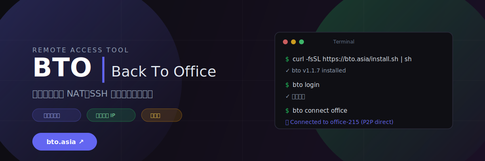
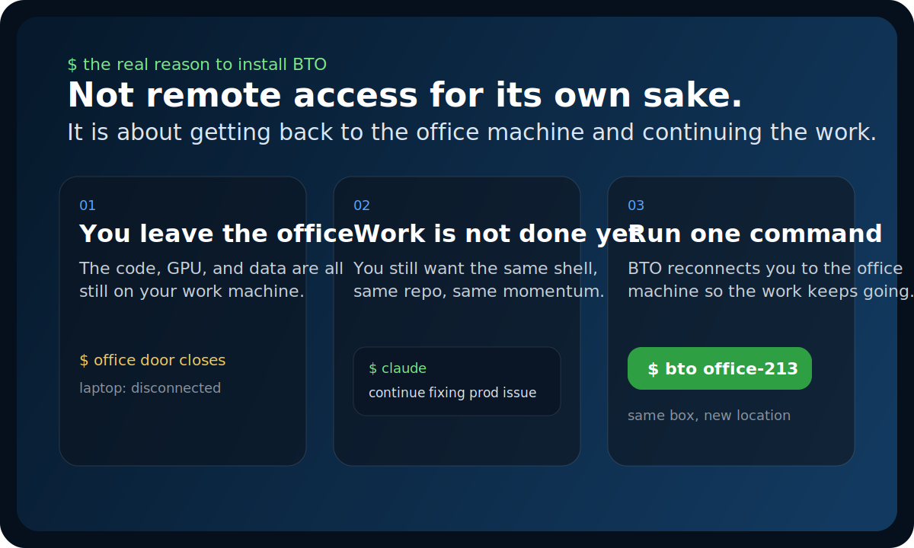

<p align="center">
  
</p>

<h1 align="center">BTO (Back To Office)</h1>

<p align="center">
  <strong>Know exactly what this is. Install it fast. Get back to your office machine and keep working.</strong>
</p>

<p align="center">
  <a href="https://github.com/hbliu007/back-to-office/releases/latest">
    
  </a>
  <a href="https://github.com/hbliu007/back-to-office/releases/latest">
    
  </a>
  
  
  
</p>

<p align="center"><a href="https://bto.asia/register"><strong>Create Account</strong></a> · <a href="#start-here"><strong>Install</strong></a> · <a href="https://bto.asia/dashboard"><strong>Open Dashboard</strong></a> · <a href="SECURITY.md">Security</a></p>

> This GitHub repository is intentionally product-only. It is the public install surface for BTO, not the full development codebase.

## What This Is

BTO is the shortest path back to your office computer.

It is a CLI that lets you:

- register on the official BTO service
- install one small client from GitHub
- finish device setup in the BTO dashboard
- SSH back into your office machine and keep working

If your code, logs, GPU, dataset, or Claude Code session are still on the office computer, BTO is built for that exact moment.

## Start Here

### 1. Create your account

Open [bto.asia/register](https://bto.asia/register).

### 2. Install BTO

```console
$ curl -fsSL https://raw.githubusercontent.com/hbliu007/back-to-office/main/install.sh | bash
```

This installer is designed to match the latest GitHub Release assets.

- It downloads the latest release from GitHub Releases
- It installs `bto` and any companion binary bundled in that release
- It verifies SHA256 when a checksum file is published
- It defaults to `~/.local/bin` unless `/usr/local/bin` is writable

### 3. Open your dashboard and copy the setup info

Open [bto.asia/dashboard](https://bto.asia/dashboard), then follow the official onboarding flow there:

- sign in
- get your token
- register or activate your office device
- finish the setup command shown in the dashboard

### 4. Connect back to the office machine

```console
$ bto office-213
```

That is the whole user journey: **register, install, configure, connect**.

## What You Get

- You leave the office but keep working on the same box
- You reopen the same repository and keep the same debugging momentum
- You keep Claude Code, Codex, or plain terminal work moving
- You avoid turning this into a whole VPN project
- You use the official BTO account and dashboard flow instead of manual network setup

## Official Service Flow

1. Install BTO from this repository
2. Create your account at [bto.asia/register](https://bto.asia/register)
3. Open your console at [bto.asia/dashboard](https://bto.asia/dashboard)
4. Get your token / device setup from the official BTO service
5. Connect back to your office machine and continue working

## Verified Today

As of **April 14, 2026**:

- The GitHub install path was verified on macOS Apple Silicon with `v1.1.0`
- The installer downloaded the current release asset, passed SHA256 verification, installed successfully, and exited with code `0`
- The official onboarding links are:
  [bto.asia/register](https://bto.asia/register) and [bto.asia/dashboard](https://bto.asia/dashboard)
- At the time of this check, those two pages were returning `HTTP 525`, so I can honestly verify the install flow end-to-end up to the dashboard handoff, but not the hosted registration flow itself until the site is back up

## Before You Install

- GitHub distributes the binary, but **GitHub does not issue user tokens**
- User accounts, tokens, and device onboarding belong to the official BTO service:
  [bto.asia/register](https://bto.asia/register) and [bto.asia/dashboard](https://bto.asia/dashboard)
- Basic installation should never require putting your personal token into a public GitHub command

## Why This Hits Home

<p align="center">
  
</p>

You leave the office.

Your code is still on the office machine. Your GPU is there. Your data is there. Your terminal session is there. Sometimes even your AI coding workflow is already open there. Maybe your real goal is just this:

- reopen that machine from home
- continue the same debugging session
- keep Claude Code, Codex, or plain SSH work moving on the same box
- avoid asking IT for VPN access or touching router / firewall settings

That is the emotional job BTO is built for.

Not "networking infrastructure". Not "a full platform". Just getting you back onto your office computer so work continues.

## What BTO Is

- One small CLI for reaching an office or lab machine over SSH from anywhere.
- Built for people who need remote shell access, not a full mesh VPN or admin platform.
- Designed to be understood in one screen and installed in one command.

| Platform | Asset |
|:--|:--|
| macOS Apple Silicon | `bto-vX.Y.Z-darwin-arm64.tar.gz` |
| macOS Intel | `bto-vX.Y.Z-darwin-amd64.tar.gz` or `darwin-x86_64` |
| Linux x86_64 | `bto-vX.Y.Z-linux-amd64.tar.gz` |
| Linux ARM64 | `bto-vX.Y.Z-linux-arm64.tar.gz` |

## Your First Connection

What happens after the dashboard setup:

- BTO uses your configured official BTO account and device context
- `peerlinkd` starts if needed
- BTO reuses the local bridge and launches SSH for you
- your office machine feels like it is back under your fingertips

## The One-Line Pitch

BTO is for the moment when you close your office door, open your laptop somewhere else, and want the same office machine back under your fingertips in one command.

## Why People Choose BTO

| Decision point | BTO | FRP | Tailscale | Traditional VPN |
|:--|:--:|:--:|:--:|:--:|
| Optimized for plain SSH access | `Yes` | `Partial` | `No` | `Partial` |
| One small CLI instead of a platform | `Yes` | `Yes` | `No` | `No` |
| Requires inbound port forwarding | `No` | `Often` | `No` | `Often` |
| Works with your own relay | `Yes` | `Yes` | `Partial` | `Yes` |
| Installs in one command | `Yes` | `Partial` | `Yes` | `Rarely` |

BTO wins when you want the smallest thing that gets you back into your office machine fast.

## Why The Story Matters More Than Specs

The best developer tools on GitHub tend to do three things above the fold:

- show a real screenshot or visual scene
- explain the job in one sentence
- give you one install path immediately

That is why this repository now leads with a visual story and a single install command instead of engineering structure. People do not fall in love with `src/` trees. They fall in love with the feeling of "yes, this solves my exact problem".

## Trust and Safety

- The canonical install path is GitHub Releases plus `install.sh`, not a private IP or ad-hoc file share.
- The installer only fetches release assets and validates SHA256 checksums when available.
- Basic installation does not require embedding tokens in `curl | sh` commands.
- Tokens should come from the official BTO service, not from GitHub.
- The relay is part of the transport path in relay mode, so this repo avoids absolute claims that are hard to verify for every deployment.
- Before production rollout, read [SECURITY.md](SECURITY.md) and review your own relay, logging, and credential policy.

## What This Repo Contains

- `README.md`: the product story and install path
- `install.sh`: the public installer
- `SECURITY.md`: publishing and trust guidance
- `Releases`: the binaries users actually download

## License

MIT. See [LICENSE](LICENSE).
