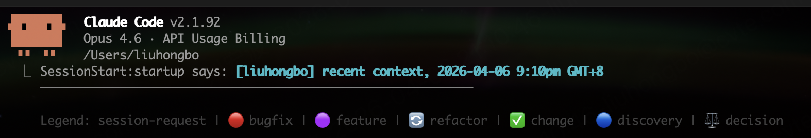
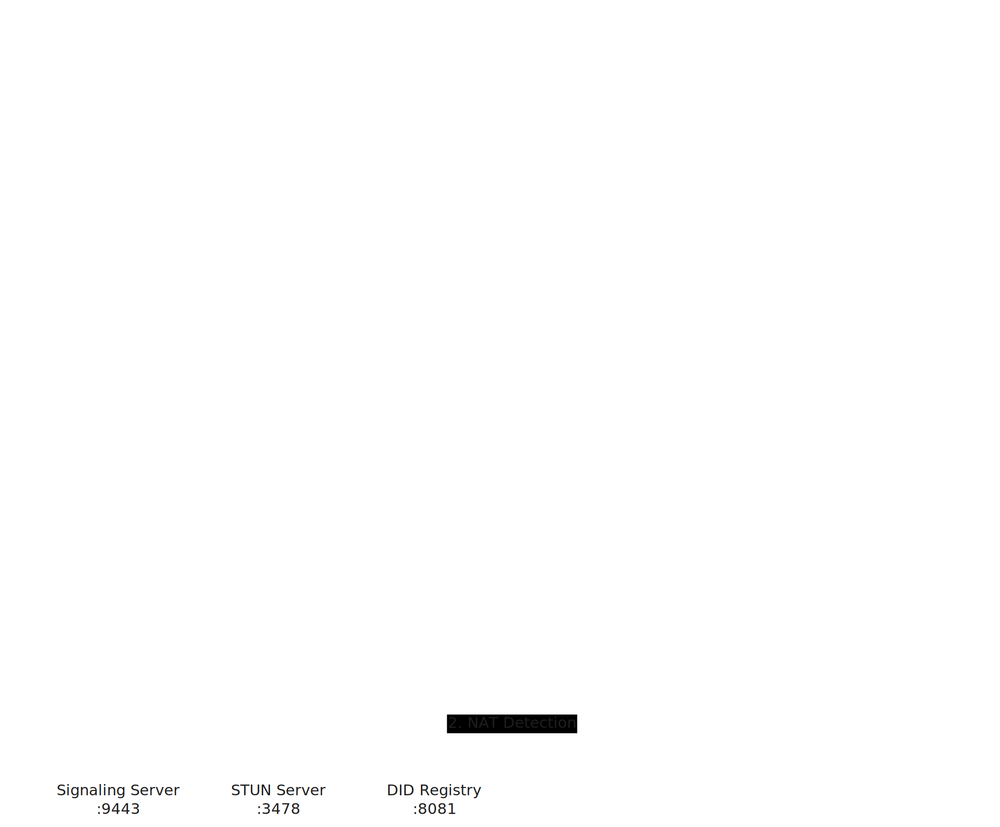

<div align="center">



</div>

<h1 align="center">BTO — Back To Office</h1>

<p align="center">
<strong>SSH into your office machine from anywhere. One command. No VPN. No public IP.</strong>
</p>

<p align="center">
Connect to your office GPU rig from a coffee shop and run <strong>Claude Code</strong>, VS Code Remote, or any SSH workflow — through NAT, firewalls, and corporate networks.
</p>

<p align="center">
<a href="https://github.com/hbliu007/back-to-office/releases/latest"></a>
<a href="#"></a>
<a href="#"></a>
<a href="LICENSE"></a>
<a href="https://github.com/hbliu007/back-to-office/stargazers"></a>
</p>

<p align="center">
<a href="https://bto.asia"><strong>bto.asia</strong></a> · <a href="#get-started-in-30-seconds">Get Started</a> · <a href="#how-it-works">How It Works</a> · <a href="#how-it-compares">Comparison</a>
</p>

---

<p align="center">
  
</p>

## Why BTO

You're at a coffee shop. Your beefy GPU machine — the one running your models, your data, your entire dev environment — sits behind a corporate firewall at the office.

**Your options today:**

- **VPN** — File a ticket, wait days, deal with split tunneling and dropped connections
- **FRP / Ngrok** — Rent a public server, configure port forwarding, manage access tokens
- **Tailscale** — Install on every device, depend on third-party DERP relay servers, pay for teams

Or you could just type **one command**.

```console
$ bto connect office-213
  ✓ Connected via P2P tunnel
  ✓ Forwarding localhost:2222 → office-213:22
```

No VPN. No public server. No firewall rules. No third-party account.

**~1 MB binary. One job, done well.**

> [!TIP]
> **Perfect for AI coding agents** — Use Claude Code, Cursor, or Copilot on your laptop while the heavy lifting runs on your office GPU. BTO gives you the SSH tunnel; the AI does the rest.

## Get Started in 30 Seconds

### 1. Install

```console
$ curl -fsSL https://bto.asia/install.sh | sh
```

Or download the binary directly from [Releases](https://github.com/hbliu007/back-to-office/releases/latest).

| Platform | File |
|----------|------|
| macOS (Apple Silicon) | `bto-v1.1.0-darwin-arm64.tar.gz` |
| Linux (x86_64) | `bto-v1.1.0-linux-amd64.tar.gz` |

### 2. Office Machine <sub>(run once, keep alive)</sub>

```console
$ bto daemon --did office-213 --relay relay.bto.asia:9700
  ✓ Registered as office-213
  ✓ Listening for incoming connections
```

### 3. Your Laptop <sub>(from anywhere)</sub>

```console
$ bto connect office-213
  ✓ Connected via P2P tunnel
  ✓ Forwarding localhost:2222 → office-213:22

$ ssh -p 2222 dev@127.0.0.1
dev@office-213:~$   # You're in.
```

That's it. Three steps. No config files, no firewall rules, no IT approval.

> [!NOTE]
> **Fuzzy matching** — `bto 213` or `bto office` works too. BTO finds the closest match.
> Works on **macOS, Linux, and Android (Termux)**.

## How It Works

BTO is built on [PeerLink](https://github.com/hbliu007/peerlink), a lightweight P2P networking library. Each device registers with a relay using a DID (Decentralized Identifier). The relay brokers the handshake, then devices establish a **direct P2P tunnel** — even through NAT and firewalls.

```
Your Laptop                  Relay Server               Office Machine
(bto connect)             (relay.bto.asia:9700)          (bto daemon)
     │                            │                           │
     │── REGISTER home-001 ──────►│                           │
     │◄── OK ────────────────────│                           │
     │                            │                           │
     │── CONNECT office-213 ────►│                           │
     │                            │── INCOMING home-001 ────►│
     │                            │                           │
     │◄═══════════ P2P Tunnel Established ══════════════════►│
     │                            │                           │
     │── SSH traffic (encrypted) ─────────────────────────────►│
     │◄── SSH traffic (encrypted) ─────────────────────────────│
```

**The relay only brokers the handshake.** Once the P2P tunnel is established, all traffic flows directly between your devices. The relay never sees your data.

<p align="center">
  
</p>

## How It Compares

| | **BTO** | FRP | Tailscale | SSH + VPN |
|:--|:--:|:--:|:--:|:--:|
| **Setup time** | **30 sec** | ~10 min | ~5 min | Hours |
| **Public server required** | No | Yes | No | Yes |
| **Port forwarding** | No | Yes | No | Yes |
| **Self-hosted** | Fully | Fully | Partially | Fully |
| **3rd-party dependency** | None | None | DERP servers | VPN provider |
| **Binary size** | **~1 MB** | ~15 MB | ~50 MB | N/A |
| **Memory usage** | **< 10 MB** | ~30 MB | ~100 MB | N/A |
| **One-line install** | Yes | Partial | Yes | No |

## Features

| | | |
|:--|:--|:--|
| **Zero Configuration** | **Cross-Platform** | **Secure by Design** |
| Single binary, no dependencies | Linux (x86_64, ARM64) | Token-based namespace isolation |
| One-line install via `curl \| sh` | macOS (Apple Silicon, Intel) | End-to-end encrypted tunnels |
| Fuzzy peer name matching | Android (Termux) | No credentials stored on relay |
| TOML config, human-readable | Windows (WSL2, planned) | Self-hosted relay option |

## Usage

```bash
# Connect (the main thing you'll do)
bto office-213              # Fuzzy match — "bto 213" works too
bto connect office-213      # Explicit connect

# Daemon (run on the office machine)
bto daemon --did office-213 --relay relay.bto.asia:9700

# Device management
bto list                    # List configured peers
bto status                  # Connection status
```

## Configuration

`~/.bto/config.toml` — simple, human-readable:

```toml
did = "home-mac"
relay = "relay.bto.asia:9700"

[peers.office-213]
  did = "office-213"

[peers.office-215]
  did = "office-215"
```

## Documentation

Full documentation is available at **[bto.asia](https://bto.asia)** or in the [docs/](docs/) directory:

- [Architecture](docs/architecture.md) — System design and modules
- [CLI Reference](docs/cli-reference.md) — All commands and options
- [Config Reference](docs/config-reference.md) — Configuration file format
- [Data Flow](docs/data-flow.md) — Session lifecycle and data flow

## Related

- [PeerLink](https://github.com/hbliu007/peerlink) — The P2P networking library that powers BTO
- [awesome-tunneling](https://github.com/anderspitman/awesome-tunneling) — A curated list of tunneling solutions

## License

[MIT](LICENSE) — free for personal and commercial use.

---

<p align="center">
  <sub>Built with frustration from coffee-shop SSH sessions that never worked.</sub>
</p>
