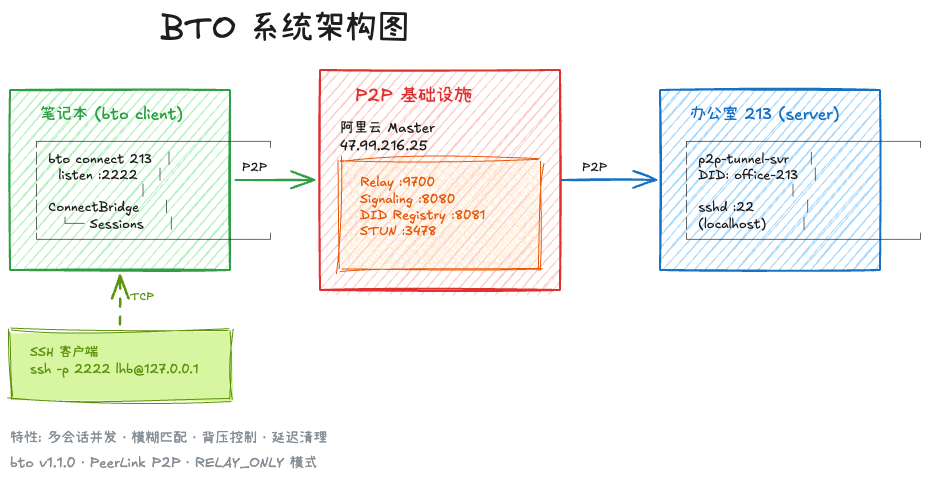
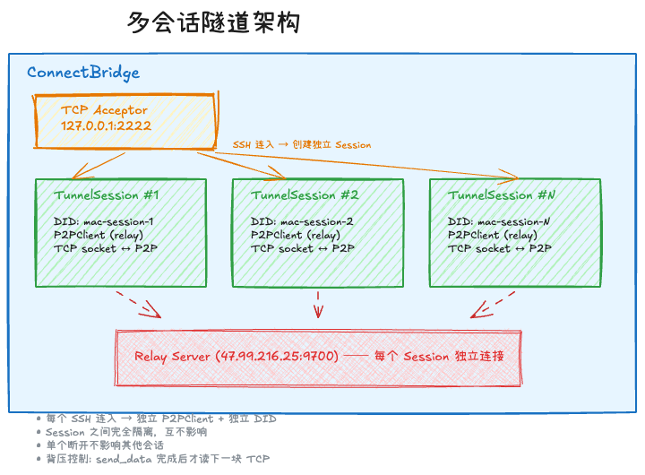
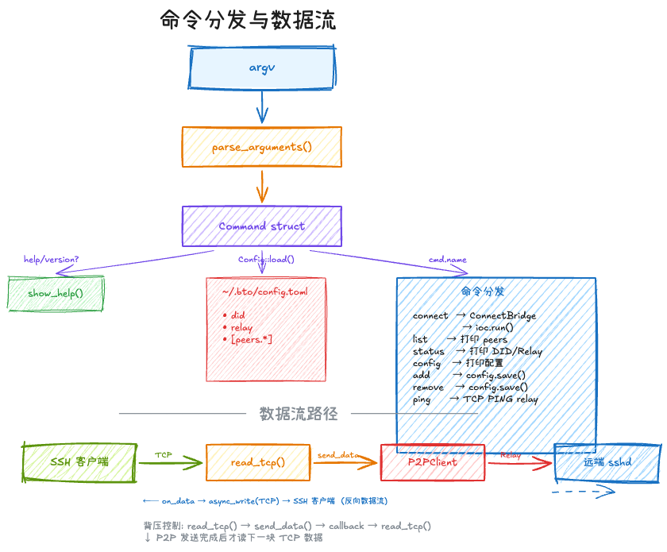

# BTO (Back-To-Office) 研发文档

> P2P SSH 隧道客户端 — 基于 PeerLink 平台

## 文档索引

| 文档 | 说明 |
|------|------|
| [architecture.md](architecture.md) | 系统架构与模块设计 |
| [build-guide.md](build-guide.md) | 编译、测试、覆盖率指南 |
| [config-reference.md](config-reference.md) | 配置文件完整参考 |
| [cli-reference.md](cli-reference.md) | 命令行接口参考 |
| [data-flow.md](data-flow.md) | 数据流与会话生命周期 |

## 设计图纸

| 图纸 | 说明 |
|------|------|
|  | 整体架构：笔记本 ↔ Relay ↔ 办公室 |
|  | 多会话隧道：ConnectBridge + TunnelSession |
|  | 命令分发与数据流路径 |

## 项目概览

BTO 是一个基于 PeerLink P2P 平台的 SSH 隧道客户端。它通过 Relay 服务器建立 P2P 连接，将远端设备的 SSH 服务映射到本地端口，实现穿越 NAT 的远程访问。

```
笔记本                    P2P 基础设施                  办公室
┌──────────┐         ┌──────────────┐         ┌──────────┐
│ bto      │  relay  │ 阿里云 Master │  relay  │ tunnel   │
│ connect  │◄──────►│ Relay:9700   │◄──────►│ server   │
│ 213      │  P2P   │ Signaling    │  P2P   │ sshd:22  │
└──────────┘         └──────────────┘         └──────────┘
     ↑                                              ↑
ssh -p 2222                                    office-213
user@127.0.0.1                                 (DID 注册)
```

## 核心特性

- **多会话并发** — 每个 SSH 连入创建独立 P2P 隧道，互不影响
- **模糊匹配** — `bto 213` 自动匹配 `office-213`
- **零配置快捷方式** — `bto <peer>` 等同于 `bto connect <peer>`
- **结构化退出码** — 脚本友好的错误码体系 (0/1/2/3/4/10)
- **SSH 配置继承** — 自动传递 user/key 到 SSH 提示

## 代码规模

| 模块 | 文件 | 行数 | 说明 |
|------|------|------|------|
| 主入口 | `bto.cpp` | 282 | 命令分发 + 7 个命令处理器 |
| CLI | `parser.hpp/cpp` | 300 | 命令行解析 + 内嵌帮助文本 |
| 配置 | `config.hpp/cpp` | 185 | TOML 解析/保存/模糊匹配 |
| P2P桥接 | `p2p_bridge_v2.hpp/cpp` | 340 | 多会话隧道管理 |
| **合计** | **7 文件** | **~1100** | |
| 测试 | `test/*.cpp` | ~900 | 116 个测试用例，覆盖率 85.5% |

## 版本

当前版本: **1.1.0** (PeerLink P2P)
